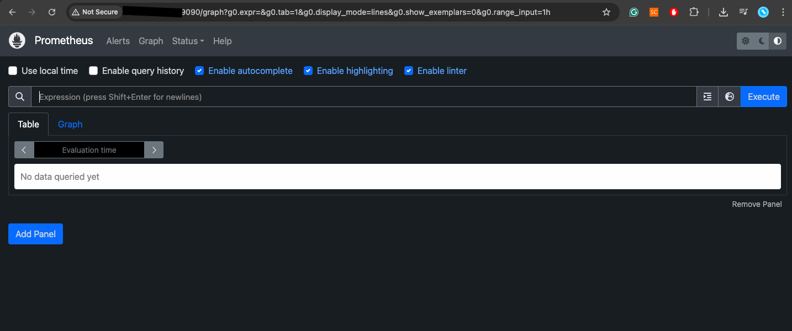
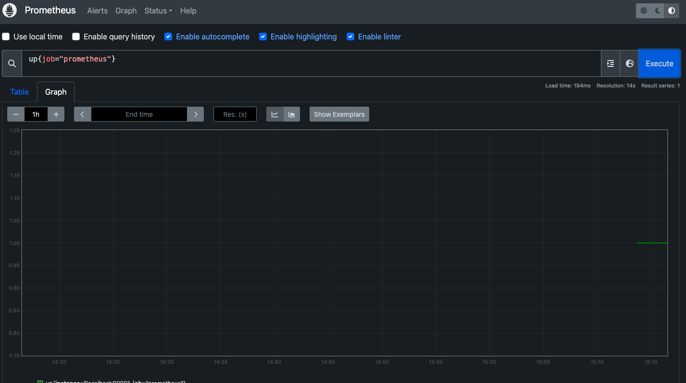

# Prometheus
PromQL

Prometheus is an open-source monitoring and alerting system built originally at SoundCloud. It's now a part of the Cloud Native Computing Foundation (CNCF), just like Kubernetes.

It's designed for reliability, scalability, and performance monitoring, especially in cloud-native and microservice environments.

## Install Prometheus Node Exporter

## Start & Enable Node Exporter 

## Config Prometheus to Scrape Metrics from Node Exporter

## Verify & Query Node Exporter metrics in Prometheus 

- Show the Prometheus server's own up status

- Show if Node Exporter is being scraped

- CPU usage over time

- Available Disk Space on Root converted to GB

- Show bytes received per second, over the last 1 minute

